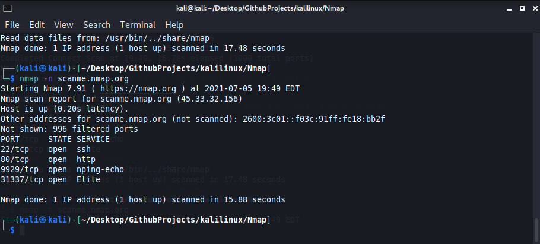

# Nmap

Quick summary 
 Nmap is an port scanner that looks for open ports and vulnerabilites in a network. Pentesters use this tool to gather information such as the OS version the target is using. Netork admin use nmap to discover various services that are running in the background.

Below is a an example how to use nmap

